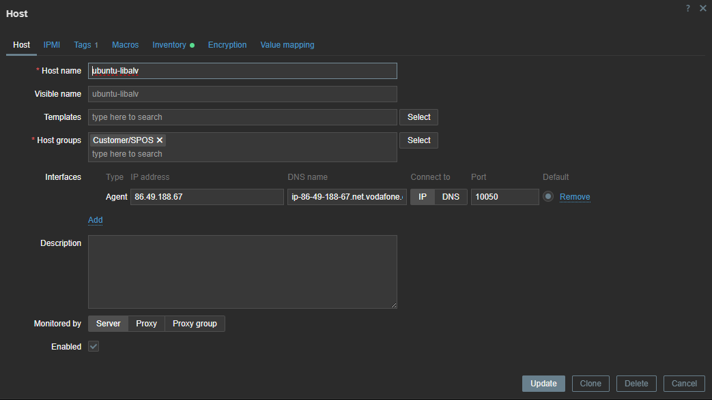

- Přidán unikátní hostname
- Nastaven Zabbix server na `enceladus.pfsense.cz`.
- Konfigurována metadata `SPOS` pro autoregistraci na serveru.
- Skripty připraveny pro automatický deploy.
- Nastaven Timeout na 30s a restart agenta po konfiguraci.

